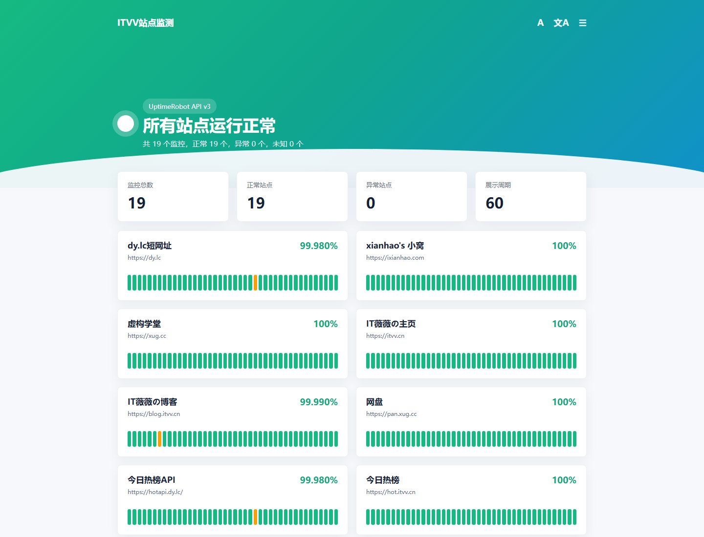

English | [简体中文](./README.md)

<h1>site-status-v3</h1>

An online status panel powered by UptimeRobot API v3

 

 
 

site-status-v3 is a lightweight open-source status page that uses UptimeRobot API v3 to fetch monitor and incident data, then presents site availability with a 60-day uptime calendar. It is suitable for personal sites, blogs, small products, and service groups, and can be deployed to Vercel, Cloudflare Pages, or other Nuxt-compatible platforms with environment variables.

## Demo

Live demo: <https://status.itvv.cn/>

## Features

- Multi-platform deployment support
- Smooth browsing experience
- Site password protection with JWT and hashing
- Overall site status preview
- Automatic data refresh
- Mobile-friendly layout

## Prerequisites

- Add your site monitors in [UptimeRobot](https://uptimerobot.com/dashboard), then get a `Read-Only API Key` from [API Management](https://dashboard.uptimerobot.com/integrations). Do not use or commit your `Main API key`.
- This project uses UptimeRobot API v3 for both monitor and incident data.

## Deployment

### Cloudflare

This project can be deployed with [Cloudflare Pages](https://pages.cloudflare.com/).

- Fork this project.
- Configure environment variables according to `.env.example`; `API_KEY` is required.
- Use `npm run build` as the build command.
- After deployment, open the site homepage and confirm that monitor data loads correctly.

### Vercel

- Click the button above to deploy.
- Configure environment variables according to `.env.example`; `DEPLOYMENT_PLATFORM` should usually be set to `auto`.
- `API_KEY` must be a UptimeRobot Read-Only API key.

### Other Hosting Platforms

See the official documentation: [Deploying Nuxt Apps](https://nuxtjs.org.cn/deploy)

## Environment Variables

| Variable | Required | Description |
| --- | --- | --- |
| `API_URL` | Yes | UptimeRobot API URL, default `https://api.uptimerobot.com/` |
| `API_KEY` | Yes | UptimeRobot Read-Only API key |
| `DEPLOYMENT_PLATFORM` | Yes | `cloudflare` or `auto` |
| `SITE_TITLE` | No | Site title |
| `SITE_DESCRIPTION` | No | Site description |
| `SITE_KEYWORDS` | No | Site keywords |
| `SITE_LOGO` | No | Site logo |
| `SITE_ICP` | No | ICP filing number |
| `COUNT_DAYS` | No | Display day count, recommended 30 to 90 |
| `SHOW_LINK` | No | Whether to show monitor site links |
| `SITE_PASSWORD` | No | Site access password |
| `SITE_SECRET_KEY` | No | JWT secret, recommended when password protection is enabled |

## Q & A

### How to Enable Site Encryption

Add `SITE_PASSWORD` and `SITE_SECRET_KEY` to your environment variables. `SITE_PASSWORD` is the site password, and `SITE_SECRET_KEY` is the encryption key. Use a random string and never commit the real value.

## Thanks

- [uptime-status](https://github.com/imsyy/site-status) inspired this project
